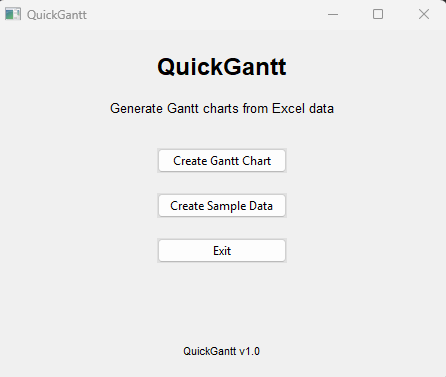
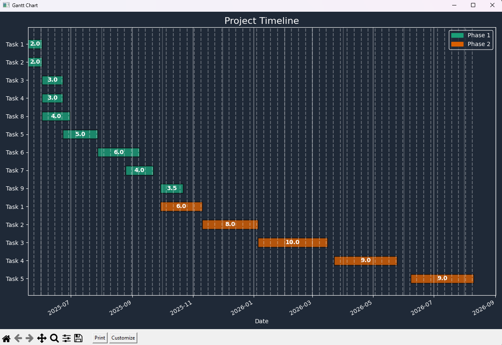
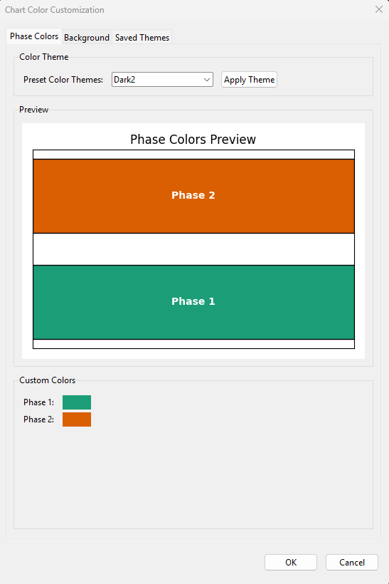

# QuickGantt

A simple yet powerful Python tool for generating professional Gantt charts from Excel data.


## Overview

QuickGantt automatically creates visually appealing Gantt charts from Excel files containing project task data. It features color-coded phases, duration labels, and customizable themes, all through a clean and intuitive user interface.

## Features

- **Simple User Interface** with automatic light/dark mode detection
- **Sample Data Generator** to help you get started quickly
- **Easy Excel File Import** via intuitive file dialog
- **Smart Column Name Detection** (case-insensitive matching)
- **Color-Coded Task Phases** for better visual organization
- **Duration Display** on each task bar
- **Customizable Themes** with ability to save and load color schemes
- **Weekly and Monthly Grid Lines** for better timeline visualization
- **Automatic Date Formatting** for clean display
- **Interactive Chart Toolbar** for zooming, panning, saving, and printing charts
- **Chart Customization** directly from the toolbar

## Screenshots







## Requirements

- Python 3.8 or newer
- Required libraries:
  - pandas
  - matplotlib
  - openpyxl
  - numpy
  - pyinstaller (for building executable)
  - tkinter (usually included with Python)

## Installation

### Option 1: Using the executable (Windows)

1. Download the latest release from the [Releases page](https://github.com/evemcgivern/QuickGantt/releases)
2. Run `QuickGantt.exe` - no installation required

### Option 2: From source code

1. Clone this repository or download the source code
2. Install dependencies:
   ```
   pip install -r requirements.txt
   ```

## Usage

1. Run the script:
   ```
   python main.py
   ```
2. When prompted, select your Excel file containing task data
3. The Gantt chart will be generated and displayed

## Excel File Format

Your Excel file should contain the following columns (the tool will try to match these names case-insensitively):

| Column Name | Description |
|-------------|-------------|
| Task | Task name/description |
| Duration_Weeks | Duration of the task in weeks |
| Phase | Category/phase of the task |
| Start_Date | Task start date |
| End_Date | Task end date |

## Example

The script will:
1. Load your Excel data
2. Match columns intelligently
3. Sort tasks by start date
4. Color-code by phase
5. Display duration values on each bar
6. Format the chart with a professional dark theme

## Troubleshooting

If you encounter errors:
- Ensure your Excel file contains all required columns
- Check that date columns contain valid date values
- Verify that your Excel file is not corrupted

## Building the Application

### Prerequisites

Before building QuickGantt, ensure you have:
- Python 3.8 or newer
- All required libraries (see Requirements section)
- PyInstaller installed (`pip install pyinstaller`)

### Building from Source

QuickGantt includes a build script that handles packaging the application into a standalone executable:

1. Install the build dependencies:
   ```bash
   pip install pyinstaller
   ```

## License

This software is released under the MIT License.

Copyright (c) 2023 

Permission is hereby granted, free of charge, to any person obtaining a copy
of this software and associated documentation files (the "Software"), to deal
in the Software without restriction, including without limitation the rights
to use, copy, modify, merge, publish, distribute, sublicense, and/or sell
copies of the Software, and to permit persons to whom the Software is
furnished to do so, subject to the following conditions:

The above copyright notice and this permission notice shall be included in all
copies or substantial portions of the Software.

THE SOFTWARE IS PROVIDED "AS IS", WITHOUT WARRANTY OF ANY KIND, EXPRESS OR
IMPLIED, INCLUDING BUT NOT LIMITED TO THE WARRANTIES OF MERCHANTABILITY,
FITNESS FOR A PARTICULAR PURPOSE AND NONINFRINGEMENT. IN NO EVENT SHALL THE
AUTHORS OR COPYRIGHT HOLDERS BE LIABLE FOR ANY CLAIM, DAMAGES OR OTHER
LIABILITY, WHETHER IN AN ACTION OF CONTRACT, TORT OR OTHERWISE, ARISING FROM,
OUT OF OR IN CONNECTION WITH THE SOFTWARE OR THE USE OR OTHER DEALINGS IN THE
SOFTWARE.
